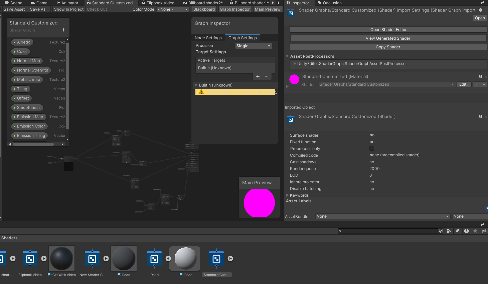
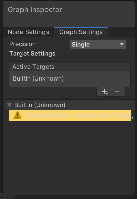
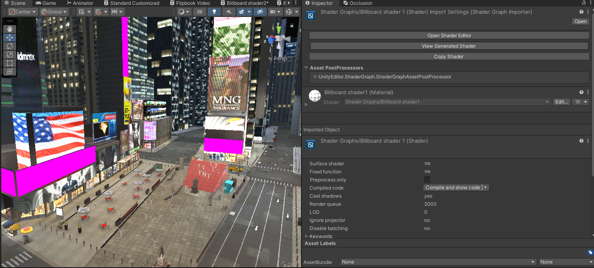

# Massive-Loop-Template-Worlds-Bowling-Alley
Template Game World for creators in Massive Loop

Massive Loop invites you to step into a collection of beautifully crafted virtual worlds. Each one designed to pull you in with atmosphere, detail, and presence. Whether you explore vibrant cityscapes, awesome fun games, tranquil environments, stylized fantasy realms, or community-built creations, Massive Loop provides an immersive platform where users, creators, and communities come together.

To help creators get started quickly, Massive Loop offers a suite of ready-to-use template worlds that you can download, customize, and expand. One of these templates is the Bowling Alley Game environment a physics driven, cross platform compatible, synchronized multiplayer bowling experience.

## Unity Editor Requirements
Please Navigate to the package manager and ensure that the following two Unity packages, these are dependents :
* Post Processing
* ShaderGraphs
* TextMeshPro

Please also make sure that your editor is using the Built-In Renderer.

## Seeing Pink Textures? No worries!
Sometimes, when exporting shadergraphs from the Unity Editor, shadergraphs can sometimes lose their active target locations. 

Luckily for us it is a very easy fix.

Navigate toward the Shaders folder found in the Times Square subfolder in the asset. You will want to click on the **"Open Shader Editor"** button

Next, where you see the **"Active Targets"** section in your graph inspector, simply click the plus button and select **"Built-In"**

Next, click on the **"BultIn (Unknown)"** Active target and remove it by pressing the minus button. Press **CTRL + S** on your keyboard and it should fix itself! 

If it does not reimport itself, right click on the shader and click **reimport**

And there you have it! 

Times Square will be restored to its glory, all thanks to you and the handy Shadergraph toolset!

*(Looks like I missed a couple billboards!)*

## Setting Up Your Massive Loop World

Please ensure that you have the correct Unity Editor version that is compatible with our SDK. Currently, the Unity Editor version we recommend using is **Unity 2022.3.18f1**. This is subject to change.

You will need our most up to date SDK version which can be found at the following link : 
https://massiveloop.com/download/sdk/
